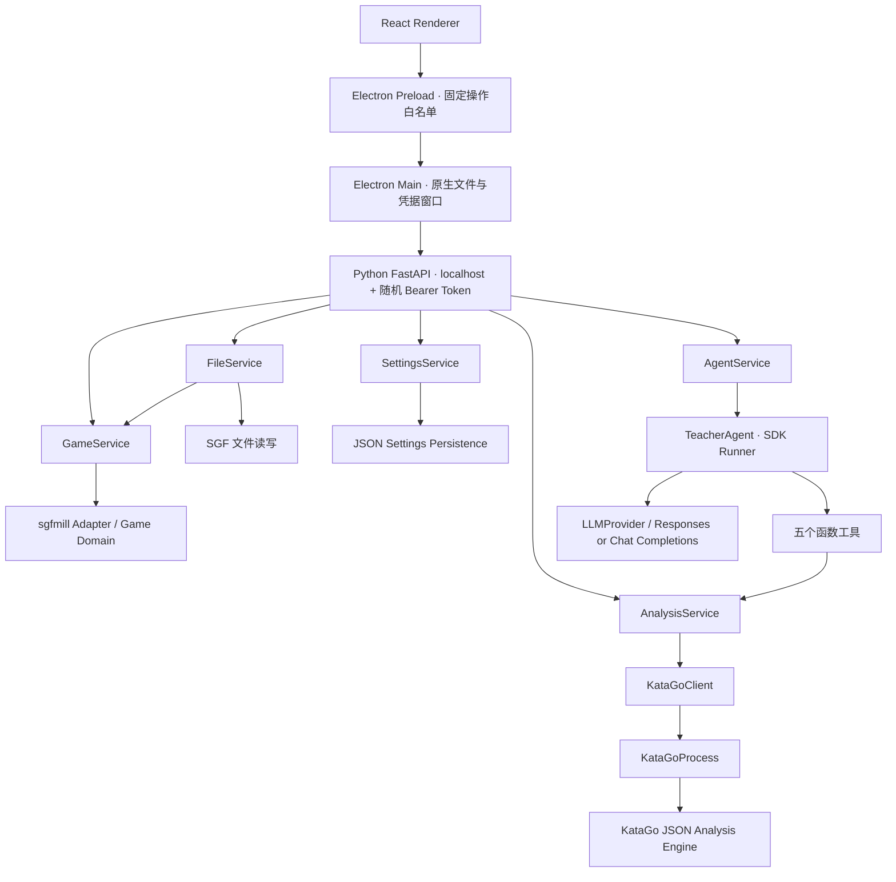
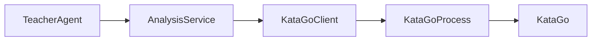

# LLMgo 架构

核心调用链：

## 职责与目录

- `desktop/src/board`：Shudan 封装、展示坐标转换；棋局真实状态与 PV 提子均由 Python 提供。
- `desktop/src/gametree`：展示 Python 的节点和父子关系，不解析 SGF。
- `desktop/src/analysis`：展示统一 CandidateMove 和 Marker，不解释引擎 JSON。
- `desktop/src/teacher`：展示结构化回答和工具调用记录。
- `desktop/src/settings`：设置表单；仅接收 Key 是否存在，不接收 Key 内容。
- `desktop/electron/main`：生命周期、原生文件对话框、凭据输入/加密、固定 API 代理。
- `desktop/electron/preload`：contextBridge 白名单；无任意 URL、shell、读写文件接口。
- `backend/api`：Pydantic 入参、调用 Service、单会话操作锁。
- `backend/domain`：Game、GameNode、Move、BoardState、GameContext、业务分析模型，无 UI 依赖。
- `backend/services/game_service.py`：当前棋谱状态、导航、真实落子/编辑/撤销、分析推荐编号和 revision 校验。
- `backend/services/file_service.py`：仅 SGF 打开/原子保存。
- `backend/services/analysis_service.py`：分析局面、指定点、比较、PV、视角统一及缓存；所有上层共享此实例。
- `backend/services/agent_service.py`：单次提问快照、单个 TeacherAgent、请求取消、真实 GPT 测试。
- `backend/services/settings_service.py`：设置读写、引擎发现、密钥内存状态。
- `backend/katago/process.py`：spawn / stdin / stdout / stderr / shutdown / crash。
- `backend/katago/client.py`：ID、有限并发队列、路由、校验、超时、terminate 请求。
- `backend/sgf/adapter.py`：成熟 sgfmill 与业务模型间的适配，保留原树。
- `backend/agent`：提示、五个工具定义、结构化输出。工具闭包注入 AnalysisService，不持有 Process 或 Client。
- `backend/evidence`：业务分析 → PositionEvidence；无原始 KataGo JSON 进入 GPT。
- `backend/persistence`：非密钥 JSON 设置。

所有可变棋局、设置和缓存均属于 `create_app()` 创建的 Service 实例，没有 Python 模块级共享可变棋局。依赖只从 API / Service 向 Domain / Infrastructure 延伸。

## Marker 与问题快照

底层保存 GTP 标准坐标，UI/问题优先使用数字。映射权威在 GameService，前端只展示和提交意图。

- 当前分析生成前三候选的 1、2、3；新分析替换旧标记。
- 棋盘空点点击创建真实 B/W 节点；用户操作不创建临时标记。已有相同后续则导航，否则追加 variation。
- 导航、打开棋谱、落子、变更引擎都会递增 revision 并清空标记。
- 提问复制当前局面及 `current_markers`；沿用本问题已引用目标的编号，工具只在快照内追加空闲编号，上限五个。提问完成后同步回棋盘。
- API 请求必须携带 revision，拒绝过期标记；操作锁避免导航、分析、设置同时修改同一会话。
- PV 数字是另一个视图的手顺，棋盘内浮动按钮标示 PV 预览，退出预览恢复原推荐叠加层；默认五手，用户请求完整变化后才扩展。
- 推荐胜率/目差通过独立的无指针事件叠加层绘制到 Shudan 交叉点；右键调用原有 PV 接口，左键始终提交真实落子。候选色阶与变化树共享颜色表，使用当前行棋方视角的 `max(candidate.score_lead) - candidate.score_lead`，下限为零。
- 手数模式由 Settings 的 `move_number_mode` 持久化；F4 和界面设置更新同一 Renderer 状态并串行写入 Settings。
- 推荐编号只用于分析证据；真实手数由 SGF 路径推导。全局证据不能推导单块棋的确定死活。
- 撤销记录是序列化 SGF 快照、节点 ID 序列和 current node，不维护第二棵棋谱树。正常编辑保留原节点 ID，Renderer 复用树投影及 keyed DOM。
- Provider 共用同一个 TeacherAgent / 工具 / 证据逻辑；OpenAI 使用 Responses，DeepSeek 与兼容服务使用 Chat Completions。兼容服务最终 JSON 由本地 schema 验证，不要求服务端支持 strict structured output。

## 分析事实

引擎进程显式统一为 BLACK 视角，AnalysisService 转成当前行棋方视角。候选的 winrate / scoreLead / visits / prior / pv 进入业务模型；ownership / policy / humanPolicy 预留字段但默认不请求。

指定着使用 `allowMoves` 限制根节点，确保冷门用户落点得到真实搜索；比较逐个分析同一局面的候选，避免把未搜索落点当成结果。保留起始摆子、走子历史、rules、komi 和行棋方；中途摆子从该设置节点重新建立引擎历史。

内存缓存最多 128 项。键包含引擎/模型/config 路径、完整初始局面、走子历史、规则、贴目、行棋方、visits 和落点限制。变更设置关闭旧进程并清空缓存。

## 接口与生命周期

主要 API：`GET /health`、`POST /game/open`、`POST /game/save`、`GET /game/state`、`POST /game/navigate`、`POST /analysis/current`、`POST /analysis/marker`、`POST /agent/ask`、`GET/POST /settings`、`POST /settings/test-katago`、`POST /settings/test-openai`。

编辑接口：`/game/play`、`/game/edit`、`/game/comment`；引擎接口：`/engine/start`、`/engine/restart`；分析支持 `/analysis/stop` 与 `/analysis/preview`。Main 专用 `/settings/credential` 与 `/shutdown` 不在 Renderer 操作白名单。所有接口都要求 Main 生成的随机 token，绑定 127.0.0.1，不开放 CORS、API 文档或任意文件系统/shell/引擎透传。

Main → 启动 Core → 等待 health → 加载 UI。Renderer ready 后请求 `/engine/start`，后台初始化任务复用 KataGoClient 的启动锁；完成一次搜索后为 ready。初始化不占用棋谱操作锁；切换引擎先取消请求并关闭旧进程。退出先取消 Agent，关闭 KataGo 的 stdin 并等待，必要时 kill，随后结束 Python。Windows 最终以已知 Core PID 结束其进程树；Python 父进程监视器处理 Main 意外结束。

## 明确禁止

- Renderer → KataGo / OpenAI / Python URL / 文件系统。
- UI → KataGoClient；Agent → KataGoProcess。
- GameService → OpenAI。
- Domain / Infrastructure → UI。
- KataGoClient → Agent；SGF Parser → React。
- 在 UI 与 Agent 中重复实现分析逻辑或维护两份真实棋局。

第一版只有一个 TeacherAgent；不实现多 Agent、RAG、画像、训练计划、云同步、账号、在线对弈、语音或自动下载模型。
